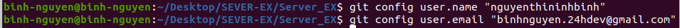
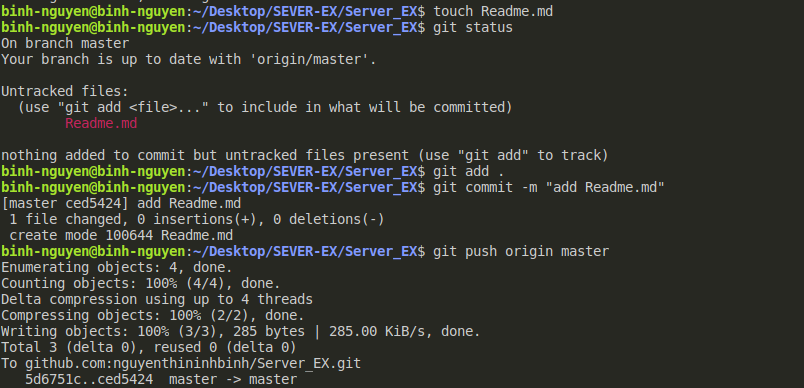
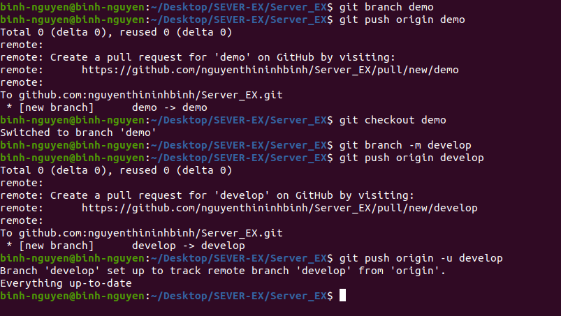
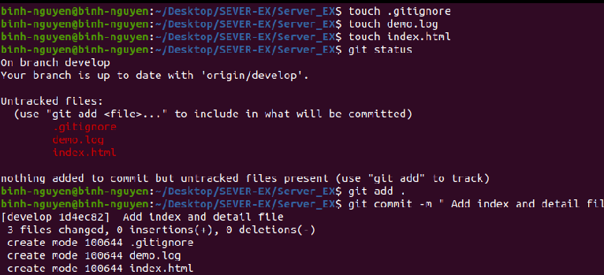
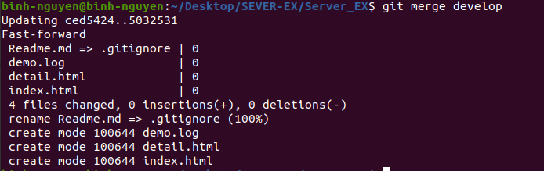

1/ config local user.name và user.email của mình.

- git config user.name "nguyenthininhbinh"

- git config user.email "binhnguyen.24hdev@gmail.com"

2/ Tạo một file README.md, commit và push

- touch Readme.md

Tai branch master:
git status

- git add Readme.md

- git commit -m "Add Readme.md file"

- git push origin master

3/ Tạo một branch mới với name “demo” và sau đó đổi tên thành “develop”

Tao nhanh va push

- git branch demo

- git push origin demo

Checkout demo va doi ten thanh develop

- git checkout demo

- git branch -m develop

Xoá branch demo trên remote và push branch develop ở local lên

- git push origin :demo develop

Reset upstream để local branch track remote branch cho branch develop

- git push origin -u develop

4/ Trên nhánh “develop”, tạo môt file demo.log, index.html, detail.html. Làm thế nào để git không tracking những file \*.log. Sau đó tạo một commit.
Tạo các flie:

- touch index demo.log

- touch index.html

- touch detail.html

Tạo file .gitinore để không tracking những file \*.log

- touch .gitinore

Tạo commit

- git add .

- git commit -m "Add index and detail"

5/ Thay đổi nội dung file index,html, detail.html và save. Sau đó revert lại nội dung commit gần nhất của 1 file index.html. Rồi tạo một commit mới, push.

revert file index.html

- git checkout -- index.html

6/ Từ master tạo một branch testing. Sau đó merge develop vào testing branch. Tạo một pull request merge testing vào master.
Tao branch testing

- git branch testing

- git checkout testing

Merge develop vào testing branch.

- git merge develop

