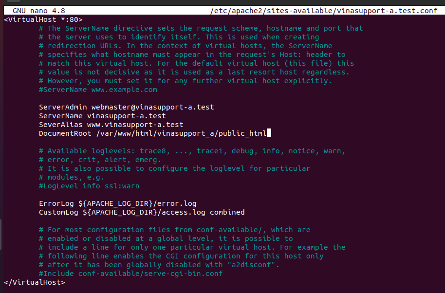

# baitap2

Virtual host (Apache)
1/ Cài đặt apache hoặc nginx

- sudo apt-get install apache2
- 

2/ Tạo virtual theo ví dụ

2.1 Cài đặt Apache Web Server

- sudo apt-get install apache2

---

2.2Tạo thư mục lưu trữ web cho mỗi một Website.

Tạo thư mục lưu trữ source code cho 2 website: - sudo mkdir -p /var/www/html/vinasupport_a/public_html - sudo mkdir -p /var/www/html/vinasupport_b/public_html

---

Tạo file index.html cho website vinasupport-a.com:

- sudo nano /var/www/html/vinasupport_a/public_html/index.html
  

Tạo file index.html cho website vinasupport-b.com:

- sudo nano /var/www/html/vinasupport_b/public_html/index.html
  

---

2.3 Phân quyền cho thư mục lưu trữ website

- sudo chown -R www-data:www-data /var/www/html/vinasupport_a/public_html
- sudo chown -R www-data:www-data /var/www/html/vinasupport_b/public_html
- sudo chmod -R 755 /var/www/html

---

2.4. Tạo file Virtual hosts config cho mỗi website

- sudo cp /etc/apache2/sites-available/000-default.conf /etc/apache2/sites-available/vinasupport-a.test.conf
- sudo nano /etc/apache2/sites-available/vinasupport-a.test.conf
  
- sudo cp /etc/apache2/sites-available/000-default.conf /etc/apache2/sites-available/vinasupport-b.test.conf
- sudo nano /etc/apache2/sites-available/vinasupport-b.test.conf
  

---

2.5. Kích hoạt file config của Apache Virtual Hosts

- sudo a2dissite 000-default.conf
- sudo a2ensite vinasupport-a.test.conf
- sudo a2ensite vinasupport-b.test.conf

---

- sudo systemctl reload apache2

---

- sudo nano /etc/hosts
- 

---

2.6 Test config

- 
- 

3/. Cấu hình thêm 1 virtual host có domain là google.com.vn

- sudo apt-get install apache2

---

- sudo mkdir -p /var/www/html/google.com.vn/public_html

---

- sudo nano /var/www/html/google.com.vn/public_html/index.html
- 

---

- sudo chown -R www-data:www-data /var/www/html/google.com.vn/public_html
- sudo chmod -R 755 /var/www/html

---

- sudo cp /etc/apache2/sites-available/000-default.conf /etc/apache2/sites-available/google.com.vn.conf
- sudo nano /etc/apache2/sites-available/google.com.vn.conf
  

- sudo a2ensite google.com.vn.conf

* sudo systemctl reload apache2

---

- sudo nano /etc/hosts
- 

---

**ket qua**

- 
